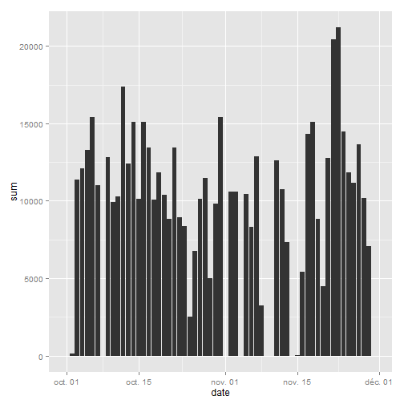
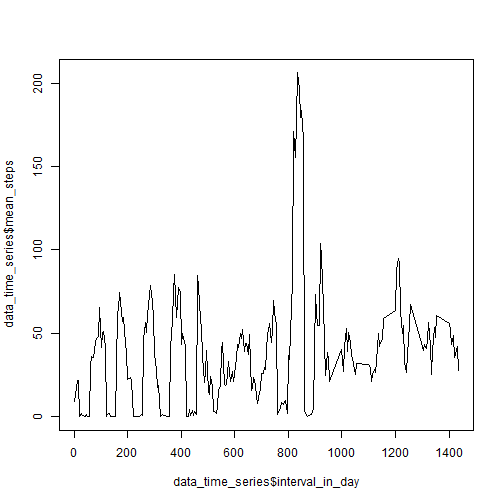
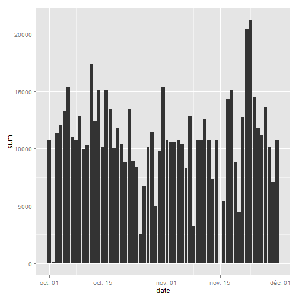

Assignment 1 Reproducible research
==================================

##Loading and processing the data

###Let's first load the data and see how it looks like

```
## Warning in unzip("repdata-data-activity.zip"): error 1 in extracting from
## zip file
```

```
## Error in file(file, "rt"): invalid 'description' argument
```

```
##   steps       date interval
## 1    NA 2012-10-01        0
## 2    NA 2012-10-01        5
## 3    NA 2012-10-01       10
## 4    NA 2012-10-01       15
## 5    NA 2012-10-01       20
## 6    NA 2012-10-01       25
```
###Now, let's transform the date column using the function as.Date()

```r
###Transform the data: create 3 new variables: year, month and day
library(dplyr)
data<-raw_data
data<-mutate(data,date=as.Date(date))
head(data)
```

```
##   steps       date interval
## 1    NA 2012-10-01        0
## 2    NA 2012-10-01        5
## 3    NA 2012-10-01       10
## 4    NA 2012-10-01       15
## 5    NA 2012-10-01       20
## 6    NA 2012-10-01       25
```

##What is mean total number of steps taken per day?

###Calculating the total number of steps per day

```r
steps_per_day<-data %>%
        group_by(date)%>%
        summarise(sum=sum(steps,na.rm=TRUE))
head(steps_per_day)
```

```
## Source: local data frame [6 x 2]
## 
##         date   sum
##       (date) (int)
## 1 2012-10-01     0
## 2 2012-10-02   126
## 3 2012-10-03 11352
## 4 2012-10-04 12116
## 5 2012-10-05 13294
## 6 2012-10-06 15420
```
###Histogram of the total number of steps taken each day

```r
library(ggplot2)
h<-ggplot(steps_per_day, aes(date,sum))
h+geom_histogram(stat="identity")
```

 
###Calculating and reporting the mean and median of the total number of steps taken per day

```r
mean(steps_per_day$sum)
```

```
## [1] 9354.23
```

```r
median(steps_per_day$sum)
```

```
## [1] 10395
```

##What is the average daily activity pattern?

###Time series plot of the 5-minute interval and the average number of steps taken, averaged across all days

```r
data<-data %>% mutate(interval_in_day=interval %% 1440)
data_time_series <- data %>%
        group_by(interval_in_day) %>%
        summarise(mean_steps=mean(steps,na.rm=TRUE))
plot(data_time_series$interval_in_day, data_time_series$mean_steps,type="l")
```

 

```r
head(data_time_series)
```

```
## Source: local data frame [6 x 2]
## 
##   interval_in_day mean_steps
##             (dbl)      (dbl)
## 1               0  9.4150943
## 2               5 13.2075472
## 3              10 21.8773585
## 4              15 21.9622642
## 5              20  0.0754717
## 6              25  2.0943396
```
###The 5-minute Interval that contains the maximum number of steps in average is

```r
data_time_series$interval_in_day[which(data_time_series$mean_steps==max(data_time_series$mean_steps))]
```

```
## [1] 835
```

##Imputing missing values

###Let's calculate and report the total number of missing values in the dataset

```r
number_rows_na <- nrow(data)-sum(complete.cases(data))
number_rows_na
```

```
## [1] 2304
```
###Strategy for filling in all of the missing values in the dataset
Chosen strategy:We will replace the missing value with the mean of the 5-minute interval
We will also create a new dataset with the missing values replated by the corresponding value

```r
data2<-data
for (i in 1:nrow(data2)){
        if (is.na(data2[i,1])){
                data2[i,1]<-data_time_series$mean_steps[which(data2[i,4]==data_time_series$interval)]
        }
}
head(data2)
```

```
##        steps       date interval interval_in_day
## 1  9.4150943 2012-10-01        0               0
## 2 13.2075472 2012-10-01        5               5
## 3 21.8773585 2012-10-01       10              10
## 4 21.9622642 2012-10-01       15              15
## 5  0.0754717 2012-10-01       20              20
## 6  2.0943396 2012-10-01       25              25
```
###Make a histogram of the total number of steps taken each day 

```r
summary_data2 <- data2 %>%
        group_by(date) %>%
        summarise(sum=sum(steps))
h2 <- ggplot(summary_data2,aes(date,sum))
h2+ geom_histogram(stat="identity")
```

 
###Calculating and reporting the mean and median total number of steps taken per day

```r
mean(summary_data2$sum)
```

```
## [1] 10766.19
```

```r
median(summary_data2$sum)
```

```
## [1] 10766.19
```
We notice that the mean and the median are different from those calculated in the first part of the assignment and that the mean and the median are equal now.

##Are there differences in activity patterns between weekdays and weekends?

###Creating a new factor variable in the dataset with two levels - "weekday" and "weekend"

```r
data2<-mutate(data2,weekday=weekdays(date))
data2[data2$weekday=="saturday"|data2$weekday=="sunday",5]<-"weekend"
data2[!(data2$weekday=="saturday"|data2$weekday=="sunday"),5]<-"weekday"
head(data2)
```

```
##        steps       date interval interval_in_day weekday
## 1  9.4150943 2012-10-01        0               0 weekday
## 2 13.2075472 2012-10-01        5               5 weekday
## 3 21.8773585 2012-10-01       10              10 weekday
## 4 21.9622642 2012-10-01       15              15 weekday
## 5  0.0754717 2012-10-01       20              20 weekday
## 6  2.0943396 2012-10-01       25              25 weekday
```
